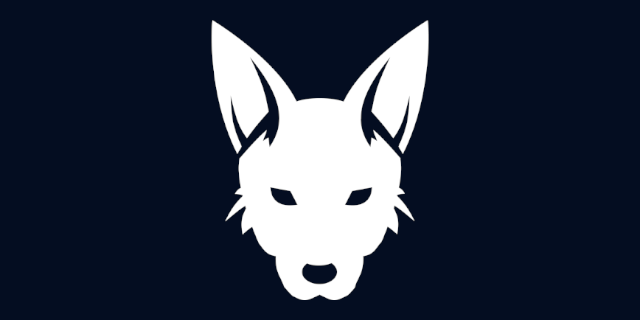

# Canine Chain by Jackal
**Canine** is a blockchain built using Cosmos SDK and Tendermint.

## Pages

1. [Modules](x/README.md)
2. [Tokens](TOKENS.md)
3. [Storage Providers](/cmd/canined/README.md)

## Installing the Canine CLI
To install `canined` on your Linux machine:

go install ./...

## Testing this chain

go test ./...

## License

Canine by Jackal uses the [MIT License](/LICENSE.md).

### [Developer Contact](/ABOUT.md)

