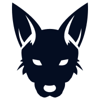

# Canine Chain
**Canine Chain** is a core component to the Jackal Protocol, a distributed cloud storage platform running on blockchain rails. This component is the replicated state machine that manages storage deals, payments and data-permissions. It is built using the Cosmos-SDK and CometBFT (formerly Tendermint).

[](https://github.com/JackalLabs/canine-chain/actions/workflows/golangci.yml)
[](https://github.com/JackalLabs/canine-chain/actions/workflows/test-unit.yml)
[](https://github.com/JackalLabs/canine-chain/actions/workflows/build.yml)

## Wiki Pages

1. [Modules](x/README.md)
2. [Tokens](TOKENS.md)
3. [Storage Providers](cmd/canined/README.md)


## Installing the Canine CLI
### Prerequisites
* Install GoLang 1.21 [here](https://go.dev/dl/)
* Install build essentials (GNU Make)

### Installing
To install `canined` on your Linux machine:

```shell
git clone https://github.com/JackalLabs/canine-chain.git
cd canine-chain
make install
```

### Pre-built Binary
[Releases](https://github.com/jackalLabs/canine-chain-chain/releases) and download the latest release. Move the executable to a folder in your `$PATH` and download [this](https://github.com/CosmWasm/wasmvm/raw/v1.1.1/internal/api/libwasmvm.x86_64.so) to `/lib/libwasmvm.x86_64.so` 

```sh
sudo wget https://github.com/CosmWasm/wasmvm/raw/v1.1.1/internal/api/libwasmvm.x86_64.so -O /lib/libwasmvm.x86_64.so
```

You may also need to run `sudo chmod +x canined` inside the executables directory to allow it to run.

## Testing this chain

```shell
make test
```

## Version Map

When Syncing, you **MUST** use the flag `--unsafe-skip-upgrades 118040` after `canined start` or else you will crash at height 118040.

|block height|canined version|
|------------|---------------|
|45381       |1.1.2          |
|0           |1.1.0          |

## License

Canine by Jackal uses the [MIT License](/LICENSE.md).

## Bug Bounty

Refer to the bug bounty program proposed by Jackal Labs [Here](https://jackaldao.medium.com/announcement-jackal-bug-bounty-program-31d4e03ab7e2)

### [Developer Contact](/ABOUT.md)

